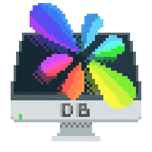

# DesktopBuddy

<p align="center">
  
</p>


DesktopBuddy brings your Windows desktop into Resonite as native-feeling world-space panels. It is built for people who want their real desktop, monitors, and application windows available inside a world without turning the experience into a flat screen overlay.


## Quick Start

Follow the [Bepis modding installation instructions](https://modding.resonite.net/getting-started/installation/) to get started.

In your mod manager, search for **DesktopBuddy** and enable it.


## Features
- Spawn full desktops, monitors, or individual application windows as grabbable curved panels.
- Interact with windows using VR controller, hand tracking, or touch input.
- Fully gpu accelerated WGC desktop capture.
- Stream panels to other users through local encoding and remote HTTPS tunnel support.
- Virtual video camera drivers for windows so you can do video calls from within resonite.
- Virtual microphone driver for windows so friends can hear you in calls in resonite.
- Use privacy controls for hiding or limiting what other users can see.
- Adjust capture, streaming, audio, culling, viewer, and debug options from the in-world settings panel.
- Keep game-side and renderer-side work separated through the shared texture bridge.


## Building

Install:

- .NET 10 SDK
- Windows SDK 10.0.26100.0 or newer

Build locally:

```powershell
powershell -NoProfile -ExecutionPolicy Bypass -File scripts\build.ps1 -Restart
```

This builds the game-side BepInEx plugin and renderer-side shared texture bridge, deploys them into the local Gale profile named `Default` when present, and restarts Resonite through that profile's BepisLoader/BepInEx targets. Add `-Desktop` for desktop mode:

```powershell
powershell -NoProfile -ExecutionPolicy Bypass -File scripts\build.ps1 -Restart -Desktop
```

Use a different Gale profile name with `-ProfileName`, or an exact profile path with `-ProfilePath`:

```powershell
powershell -NoProfile -ExecutionPolicy Bypass -File scripts\build.ps1 -Restart -ProfileName MyProfile
powershell -NoProfile -ExecutionPolicy Bypass -File scripts\build.ps1 -Restart -ProfilePath "$env:APPDATA\com.kesomannen.gale\resonite\profiles\MyProfile"
```

CI-style compile without deploy:

```powershell
powershell -NoProfile -ExecutionPolicy Bypass -File scripts\build.ps1 -NoDeploy
```


## Packaging

Thunderstore metadata lives in `thunderstore.toml`. `VERSION` is the source of truth for the plugin and package version. After changing `VERSION`, run:

```powershell
powershell -NoProfile -ExecutionPolicy Bypass -File scripts\sync-version.ps1
```

Build the Thunderstore package with TCLI:

```powershell
dotnet tool restore
dotnet tcli build
```

You can also create the same package layout locally with:

```powershell
powershell -NoProfile -ExecutionPolicy Bypass -File scripts\package.ps1
```


## Credits

Special thanks to the projects and libraries DesktopBuddy builds on.

| Project | What DesktopBuddy uses it for |
| --- | --- |
| [BepisLoader](https://thunderstore.io/c/resonite/p/ResoniteModding/BepisLoader/) | Game-side BepInEx loader |
| [BepisResoniteWrapper](https://github.com/ResoniteModding/BepisResoniteWrapper) | Resonite engine-ready startup hook |
| [InterprocessLib](https://thunderstore.io/c/resonite/p/Nytra/InterprocessLib/) | Control messages between the game plugin and renderer bridge |
| [BepInEx.Renderer](https://github.com/ResoniteModding/BepInEx.Renderer) | Renderer-side BepInEx loader |
| [RenderiteHook](https://github.com/ResoniteModding/RenderiteHook) | Renderer-side hook support |
| [FFmpeg](https://github.com/FFmpeg/FFmpeg) | H.264/HEVC encoding libraries in `DesktopBuddyNative` |
| [FFmpeg.AutoGen](https://github.com/Ruslan-B/FFmpeg.AutoGen) | C# bindings for FFmpeg, packaged in `DesktopBuddyNative` |
| [cloudflared](https://github.com/cloudflare/cloudflared) | Bundled Cloudflare Tunnel client for public HTTPS stream URLs |
| [SoftCam](https://github.com/tshino/softcam) | DirectShow virtual camera filter |
| [VB-Cable](https://vb-audio.com/Cable/) | Virtual microphone driver; no public source repository is provided by VB-Audio |
| [Harmony](https://github.com/pardeike/Harmony) | Runtime patching |
| [CsWinRT](https://github.com/microsoft/CsWinRT) | Windows Runtime interop support used by Windows.Graphics.Capture |

## License

AGPL-3.0 - see [LICENSE](LICENSE).
